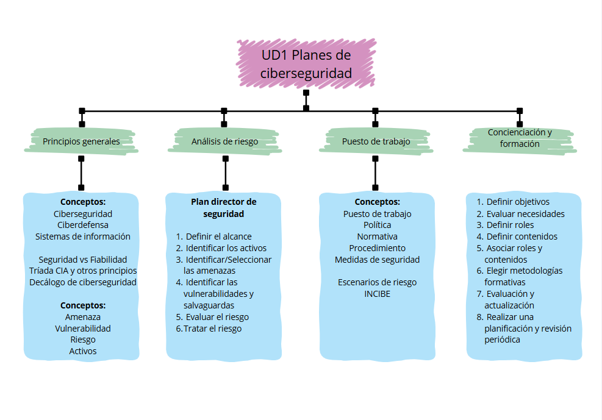

# IS-1.a..e-LES

# Resúmen Unidad 1

Trabajo realizado por: Lucía Espinosa Sánchez

## Introducción

La unidad 1 del módulo de incidentes de ciberseguridad ha sido un poco introductoria al módulo, además de haber aprendido a analizar riesgos, a desarrollar un plan director de ciberseguridad para una empresa y los pasos necesarios para llevarlo a cabo, también hemos aprendido algunas normativas que deben ponerse en práctica en el puesto de trabajo y lo importante que es la concienciación y la formación de los empleados en una empresa. Esta formación también debe enseñarse en todo tipo de organizaciones como es por ejemplo nuestro instituto, en el que iremos desarrollando nuestro propio plan de formación para poder concienciar sobre las buenas prácticas relacionadas con la ciberseguridad al resto de la comunidad educativa.

## Resúmen

### 1.1 Principios generales

En este apartado comenzamos viendo algunos términos:
- **Ciberseguridad**: Su objetivo es proteger todo lo que hay en los dispositivos y evitar que alguien no autorizado entre, dañe o robe información.
- **Ciberdefensa**: Se enfoca en responder a ataques que ya están ocurriendo o evitar que vuelvan a suceder.
- **Sistemas de información**: Son el conjunto de datos, procesos, personas y tecnologías que gestionan y manejan la información en una organización.
- **Sistemas informáticos**: Se refieren al hardware y software que permiten procesar, almacenar y transmitir información.

Además aprendemos a diferenciar entre seguridad y fiabilidad, ya que **la seguridad total no existe**, ya sea por errores informáticos inesperados, errores humanos o sucesos inesperados que haya que solucionar lo más rápido posible. Debido a esto, debemos darle mayor importancia a la fiabilidad, porque esta, es la que nos indica que los sistemas son capaces de funcionar perfectamente aunque ocurran fallos o sean atacados. **La fiabilidad destaca por su alta disponibilidad, resiliencia y tolerancia a fallos**.

Las empresas deben encontrar el **equilibrio entre la seguridad y la fiabilidad**, ya que al no poder asegurar una seguridad completa, se debe invertir más en fiabilidad para evitar que ocurran incidentes a modo de futuro o minimizar su impacto lo máximo posible, creando planes de recuperación y actuación o utilizando sistemas de respaldo.

Sobre los principios generales hay que destacar la tríada CIA, la cual incluye:
- **Confidencialidad**: Solo las personas autorizadas pueden acceder a la información.
- **Integridad**: La información debe mantenerse exacta y completa, sin modificaciones no autorizadas.
- **Disponibilidad**: La información y los sistemas deben estar disponibles cuando se necesiten.

Estos principios son esenciales cuando se va a construir cualquier estrategia de seguridad para proteger los datos. Además de estos principios podemos destacar algunos más que también son importantes:
- **Fiabilidad**: Garantiza que el sistema funcione de manera correcta y predecible, de acuerdo con lo que se espera de él, sin errores o fallos inesperados.
- **Autenticidad**: Asegura que la información o el usuario es quien dice ser, y que la información no ha sido manipulada por nadie más durante su transmisión o almacenamiento.
- **No repudio**: Significa que ninguna de las partes involucradas en una comunicación o transacción puede negar que esa acción ocurrió.

El **decálogo de la ciberseguridad** ofrece 10 principios para prevenir las amenazas y proteger los datos de forma activa. Estos principios son:
1. Cultura de la ciberseguridad y concienciación del empleado.
2. No abrir enlaces ni descargar archivos sospechosos.
3. Usar software de seguridad.
4. Limitar la superficie de exposición de amenazas.
5. Cifrar la información sensible.
6. Borrado seguro de información.
7. Realizar copias de seguridad periódicas.
8. Mantener actualizados los sistemas y aplicaciones.
9. Revisar regularmente la configuración de seguridad.

Otros conceptos que debemos tener en cuenta son:
- **Amenaza**: Cualquier evento o acción que tiene el potencial de causar daño a nuestros sistemas de información o comprometer sus principios.
- **Vulnerabilidad**: Debilidades o fallos que existen en nuestros sistemas y que pueden ser explotados por una amenaza.
- **Riesgo**: Es la probabilidad de que una amenaza tenga éxito y cause un impacto negativo en el sistema.
- **Activos**: Cualquier recurso de la empresa necesario para desempeñar las actividades diarias y cuya no disponibilidad o deterioro supone un coste. Estos pueden ser tangibles o intangibles. Además podemos diferenciar entre distintos tipos de activos: 
  - Datos.
  - Aplicaciones.
  - Hardware industrial.
  - Red.
  - Tecnología.
  - Instalaciones.
  - Equipamiento auxiliar.
 
### 1.2 Análisis de riesgos

El análisis de riesgos hace que se puedan **identificar, evaluar y priorizar los riesgos** que puedan afectar a una organización o empresa. Toda empresa que quiera proteger su información y que valore las herramientas y sistemas que tiene debe desarrollar un plan director de seguridad. Este permite definir y prioridad entre un conjunto de proyectos que tienen que ver con la seguridad de la información, dirigido a reducir riesgos. Este análisis también puede realizarse de forma aislada al plan director de seguridad. Sus fases son:
1. **Definir el alcance**: Si este análisis forma parte del plan director de seguridad diremos que cubre su totalidad. También puede definirse un alcance más limitado a departamentos, procesos o sistemas. 
2. **Identificar los activos**: En esta fase deberemos identificar los activos que forman parte del alcance definido en la fase anterior. 
3. **Identificar/Seleccionar las amenazas**: En este paso debemos identificar las amenazas a las que están expuestos los activos identificados seleccionando los que son más prácticos.
4. **Identificar vulnerabilidades y salvaguardas**: Según los activos identificados deberemos estudiar las características de los mismos para identificar puntos débiles o vulnerabilidades.
5. **Evaluar el riesgo**: Para cada par activo-amenaza hay que estudiar la probabilidad de que la amenaza ocurra y el impacto que puede provocar. El riesgo viene del cálculo de la probabilidad por el impacto.
6. **Tratar el riesgo**: Para tratar el riesgo hay que establecer un límite, a partir de este límite hay que decidir si se transfiere a un tercero, se elimina, se asume el riesgo o se implantan medidas para mitigarlo.

### 1.3 Puesto de trabajo

El puesto de trabajo es donde los empleados realizan su trabajo diario, donde se encuentran los sistemas, aplicaciones y datos que necesita para realizar su trabajo. Este puede ser físico o remoto. Algunos elementos que se incluyen en el puesto de trabajo:
- Dispositivos hardware.
- Software.
- Comunicación y acceso a la red.
- Instalaciones físicas.
- Acceso a datos.
- Personal.

Las normativas son muy necesarias en el puesto de trabajo, estas son un **conjunto de reglas y requisitos** que indican cómo gestionar y asegurar los distintos aspectos del puesto de trabajo para proteger la información y los sistemas. 

Debemos diferenciar entre algunos conceptos:
- **Política**: Define la intención y los principios de una organización sobre un tema específico. Esta, establece el marco de referencia que guía las acciones para proteger los activos.
- **Normativa**: Reglas y requisitos más concretos que deben cumplirse para seguir las políticas.
- **Procedimiento**: Pasos específicos que deben seguirse para cumplir las normativas y de esta forma, también las políticas.
- **Medidas de seguridad**: Estas medidas que deben llevarse a cabo, pueden clasificarse según su nivel de complejidad (Básico o avanzado) o según su alcance (Procesos, tecnología o personas). Además pueden clasificarse en preventivas, de monitorización o correctivas.

Para aplicar o crear estas normativas se deben aplicar algunos estándares como el **ISO/IEC 27001, el GDPR o el LOPDGDD**. 

En los puestos de trabajo se deben tener en cuenta los escenarios de riesgo para implementar medidas que sean efectivas. Vamos a diferenciar algunos escenarios según los activos:
- **Dispositivos de hardware**:
  - Pérdida o robo.
  - Acceso no autorizado.
  - Falta de cifrado.
  - Infección de malware o software malicioso.
- **Software y aplicaciones**:
  - Descarga o uso de software no autorizado.
  - Uso de software desactualizado.
  - Falta de control en los permisos de acceso a aplicaciones.
  - Riesgo de fugas de información a través de aplicaciones en la nube o compartidas.
- **Comunicación y acceso a la red**:
  - Acceso no seguro a redes públicas.
  - Acceso no autorizado a la red comparativa.
  - Fugas de datos a través de aplicaciones en la nube.
  - Intercepción de datos sensibles durante la comunicación.
- **Instalaciones físicas**:
  - Acceso no autorizado a áreas restringidas.
  - Exposición de información confidencial en áreas compartidas.
  - Pérdida o robo de dispositivos en las instalaciones.
  - Descuido en la gestión de residuos de documentación confidencial.
- **Acceso a datos**:
  - Permisos excesivos o inadecuados.
  - Acceso no autorizado a información confidencial.
  - Compartición insegura de información sensible.
  - Falta de seguimiento y auditoría de los accesos a datos.
- **Personal**:
  - Falta de concienciación en seguridad de la información.
  - Hábitos inseguros de trabajo.
  - Exposición a amenazas de ingeniería social.
  - Desconocimiento o incumplimiento de políticas de seguridad.

INCIBE ha creado algunas políticas para que las PYMES puedan mejorar su seguridad y gestionar los riesgos de manera más organizada, para la que deberemos de seguir los siguientes pasos:
1. Identificar los elementos de seguridad esenciales.
2. Asignar roles y responsabilidades.
3. Adaptar las políticas a necesidades específicas.
4. Usar la Checklist para seguimiento.

### 1.4 Concienciación y formación

El plan de formación sirve para capacitar a los empleados para prevenir, mitigar o responder ante las posibles amenazas. Este, busca identificar amenazas potenciales, mitigar riesgos y responder adecuadamente en caso de incidente. La formación debe ir enfocada para todo el personal, diferenciando entre el personal especializado los cuales tendrán una formación más técnica, y el resto de empleados que tendrán una formación más básica. La repetición y actualización son esenciales para garantizar que el personal esté al día con las amenazas y medidas más recientes.

El plan de formación y concienciación debe garantizar que los empleados conozcan y entiendan las normativas y medidas de seguridad, que sea capaz de identificar comportamientos sospechosos y que notifique de manera efectiva al personal especializado. Para diseñarlo, debemos tener en cuenta los roles que existen en la organización, los tipos de información, los servicios disponibles, sus políticas y las características específicas.

Para elaborar el plan de formación hay que seguir algunos pasos:
1. Definir los objetivos del plan de formación y concienciación.
2. Evaluar las necesidades realizando encuestas o entrevistas.
3. Definir los roles y diferenciar los contenidos estrategias para cada uno de ellos.
4. Definir los contenidos del plan de formación, entre los que podemos incluir:
  - Uso de contraseñas y sistemas de verificación.
  - Reconocimiento de phishing.
  - Peligros de descargas y uso de software no autorizado.
  - Uso apropiado de internet.
  - Ingeniería social.
  - Uso de dispositivos de almacenamiento externo.
  - Políticas de trabajo remoto.
  - Uso de redes inalámbricas.
  - Actualización de software.
  - Copias de seguridad.
  - Notificación de incidentes.
  - Leyes y normativas.
  - Política de “mesas limpias”.
5. Asociación de roles y contenidos para adaptar los contenidos a cada grupo.
6. Elegir las metodologías formativas para maximizar el impacto y garantizar que los empleados participen activamente, utilizando distintos materiales como presentaciones, carteles o ataques simulados, o creando un calendario de formación.
7. Evaluación y actualización del plan de formación realizando encuestas y pruebas de que la formación ha ido bien, además de realizar una mejora continua y formación de refuerzo.
8. Realizar una planificación y revisión periódica por si hay que añadir nuevos contenidos o modificar los que ya están.

### Esquema

### Conclusiones personales

El tema tiene puntos bastante útiles como el análisis de riesgo, el plan director de seguridad o el plan de concienciación y formación, que nos podrán servir en el ámbito laboral. Algo que también deberemos utilizar en el trabajo serán las políticas y normativas, ya que cada empresa tendrá las suyas y hay que seguirlas. 

El punto que creo que será más útil en el trabajo es el de políticas y normativas, ya que cada empresa tendrá algunas e incluso quizás podrían implementar unas nuevas.

La mayoría de los puntos tratados en esta unidad no los conocía, sobre todo el plan director de seguridad, que es un documento más formal y técnico de cara a las empresas.

El tema que me ha parecido más interesante ha sido el plan de concienciación y formación, además de que la dinámica que realizaremos para formar y concienciar en lo posible al centro me parece una forma muy buena de ponerlo en práctica.

En cuanto a los temas tratados en general, no descartaría ninguno aunque quizás todo lo que son conceptos los pondría en un glosario de términos aparte de la unidad, en el que podrían estar los conceptos principales de todo el módulo.
